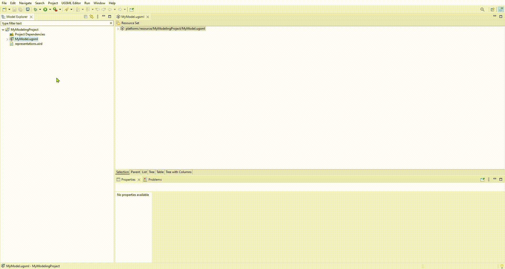

# Unreal Game System Modeling Language (UGSML)

Welcome to UGSML source code!

UGSML is a Domain Specific Modeling Language (DSML), based on [Eclipse Framework](https://www.eclipse.org), created using [Sirius](https://www.eclipse.org/sirius) to define graphical elements and [Acceleo](https://www.eclipse.org/acceleo) as the transformation engine. UGSML is used to generate C++ code of attribute systems as a component for [Unreal Engine](http://www.unrealengine.com) projects. UGSML is the result of my master's thesis in [MDSE Research Group](https://mdse.ui.ac.ir) at [University of Isfahan](https://ui.ac.ir/en).

## Features
UGSML is a powerful Domain Specific Modeling Language (DSML) that offers a range of features to help you generate C++ code of attribute systems for your Unreal Engine projects.

### UGSML Key Features:
- Graphical modeling: UGSML is based on Eclipse Framework and uses Sirius to define graphical elements, making it easy to create and modify models visually.
- Code generation: UGSML uses Acceleo as the transformation engine to generate C++ code from your models, saving you time and effort.
- Integration with Unreal Engine: The generated code can be easily integrated into your Unreal Engine projects, allowing you to quickly create attribute systems for your game objects.
- User-friendly interface: UGSML has a user-friendly interface that makes it easy for both novice and experienced users to create models and generate code.
- Extensibility: UGSML is highly extensible, allowing you to add new features and functionality as needed.
- Compile time: UGSML provides you full code of the defined attribute system, allowing you to compile your code once and save compilation time.

### Supported Data Types and Constraints:
1. Integer/Decimal Data Types
    1. Base Constraint
    2. Range Constraint
    3. Conversion Dependency Constraint
    4. Regeneration Constraint
    5. Margin of Error Constraint
    6. Direct Dependency Constraint
    7. Distortion Constraint
2. Boolean Data Types
3. Character/Name/String/Text Data Types
    1. Length Constraint
    2. Filter Constraint
4. Vector2D/Vector/Rotator/Transformation Data Types
    1. Range Constraint
5. Color Data Type
    1. Filter Constraint
6. Texture/Model/Particle/Audio/Material/Animation Data Types
7. Enumeration Data Type
8. Structure Data Type

For more detailed explanation of data types and constraints, please refer to our documentation at [UGSML Documentation](https://hail-target-97a.notion.site/345dc4a516474bcbbb1fd0fa773d5c49?v=d31a38e0cb61462c8ba0cf950b87b62b) page.

### UGSML DEMO

  

Overall, UGSML is a powerful tool for anyone looking to streamline the process of creating attribute systems for their Unreal Engine projects. With its graphical modeling capabilities and seamless integration with Unreal Engine, it's an essential tool for any game developer.

## Getting Up and Running
Here is the steps to a fresh installation of UGSML (requires JDK 11 onwards):
1. Download and install Eclipse Modeling Framework (EMF), version 2022-12 for Java Developers from [This Link](https://mirror.dogado.de/eclipse/technology/epp/downloads/release/2022-12/R/eclipse-modeling-2022-12-R-win32-x86_64.zip).
2. Download the necessary files from the [Release](https://github.com/AmirrezaPayandeh/UGSML/releases/tag/V1.0.0) page.
3. Unzip the UGSML_1.0.0.zip file and copy the extracted files to your `"eclipse installation path/dropins"`.
4. Open Eclipse and go to Help > Eclipse Marketplace.
5. Search for "Sirius" and install version 7.1.
6. Search for "Acceleo" and install version 3.7.
7. Restart the editor.

The easier installation process is available at the [UGSML Documentation](https://hail-target-97a.notion.site/345dc4a516474bcbbb1fd0fa773d5c49?v=d31a38e0cb61462c8ba0cf950b87b62b) page.

## Getting Started
Here are the steps to create a UGSML modeling project:
1. After opening the eclipse editor and setup a workspace, we can create a new modeling project by going to `File > New > Modeling Prject`.

  

2. Next, we can add a new UGSML modeling project by right-clicking on the modeling project and going to `New > Other` and searching for “ugsml”. Select the UGSML Model and click Next. In the next window, choose a name for your model and click Next. In the next window, for the Model Object section, select Root and hit Finish.

  

3. Now we need to add a graphical representation to the model that we created. Right-click on the modeling project and select `Create Representation`. From the opened window, select MainDiagram from the left panel and hit Next. Select “Root” and hit Finish. Choose a name for your diagram and hit Ok. Save the diagram (Ctrl + S) to add the diagram to the modeling project.

  

4. Now you can start modeling in UGSML.

For more detailed tutorials on using UGSML, please refer to our documentation at [UGSML Documentation](https://hail-target-97a.notion.site/345dc4a516474bcbbb1fd0fa773d5c49?v=d31a38e0cb61462c8ba0cf950b87b62b) page.

## Participating in Evaluation
I am currently working on my master's thesis project, and I would like to invite you to participate in the evaluation process. Your feedback is crucial in helping me improve the project and ensure its success.

Your participation will involve testing the project and providing feedback on its usability, functionality, and overall effectiveness. Your input will help me identify any areas that need improvement or adjustment, as well as any potential issues that may arise during implementation.

Participating in this evaluation process is completely voluntary, but your contribution would be greatly appreciated. Your feedback will be kept confidential and used solely for the purpose of improving the project.

### Link to the evaluation form:

* **[UGSML Evaluation Form (English)]()**

Thank you for considering this opportunity to contribute to my master's thesis project. Your feedback is invaluable, and I look forward to hearing from you.

## Contributing
Contributions to UGSML are welcome! To contribute, follow these steps:

1. Fork the repository on Github.
2. Create a new branch with your changes: `git checkout -b my-feature-branch`.
3. Make your changes and commit them: `git commit -am 'Add new feature'`.
4. Push your changes to your fork: `git push origin my-feature-branch`.
5. Submit a pull request on Github.

## License
UGSML is licensed under the EPL License. See [LICENSE](https://github.com/AmirrezaPayandeh/UGSML/blob/master/LICENSE) for more information.

## Contact
For questions or support, please contact me at BlackLord.ap@gmail.com.
